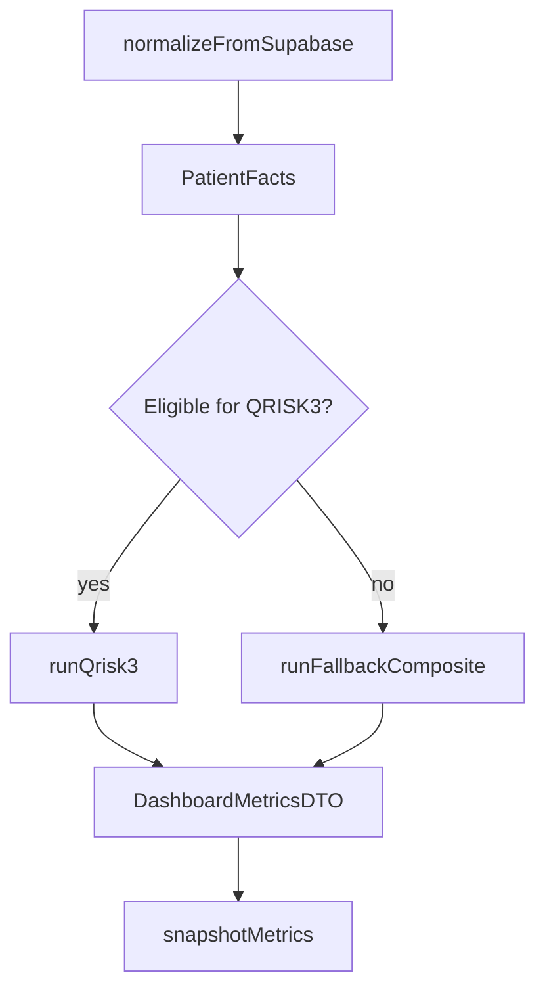

# Inference engine — execution model

## Overview

## Eligibility for QRISK3

Run QRISK3 when **all** hold:

1. **Age** between **25 and 84** (inclusive).
2. **Sex at birth** mapped to `male` or `female` (not “prefer not to say” without a mapped default — engine uses fallback).
3. **BMI** present or imputed (default 25).
4. **Systolic BP** present or imputed (default 120 mmHg).
5. **No explicit prior CVD** flag from parsed conditions (MI, stroke, angina, PAD as documented in exclusion list).

## Imputation policy (missing clinical inputs)

| Field | Default | Notes |
|-------|---------|--------|
| Total cholesterol / HDL ratio | **4.0** | Common neutral placeholder; flag `cholesterolHdlRatio` |
| Systolic BP SD | **5** mmHg | Typical visit-to-visit noise placeholder |
| Townsend deprivation | **0** | Missing postcode linkage |
| BMI | **25** kg/m² | If height/weight absent |

Every imputed field is listed in **`imputedFields`** in the API response.

## Forward chaining order

1. Load raw rows → merge `onboarding_draft` + `patient_profiles.payload`.
2. Parse free-text conditions, meds, lifestyle, family history.
3. Merge latest vitals (table overrides static onboarding vitals for BP/BMI when newer).
4. Derive clinical flags (diabetes type, treated hypertension from meds + conditions).
5. Chronic burden index (RULE-COND-001).
6. Preventive hints (RULE-PREV-001).
7. CVD path: QRISK3 or fallback (RULE-QRISK-001 / RULE-FB-001).
8. Persist snapshot to `health_dashboard_metrics` for trend deltas.

## Conflict resolution

- **Table vitals vs onboarding:** newer `measured_at` (or `created_at`) wins per metric.
- **Duplicate patient_profiles rows:** use most recently updated row.

## Trend (“vs last snapshot”)

On each request, the engine loads the **latest row** in `health_dashboard_metrics` for the user (if any). Delta = current primary CVD value − prior stored value when **`method` matches** (QRISK3 vs RULE_FALLBACK). If no prior row, `hasHistory: false`.  
Inserting a new snapshot row is **throttled** (e.g. minimum hours between inserts); trend still uses the last stored row even when a new snapshot is not written this request.
